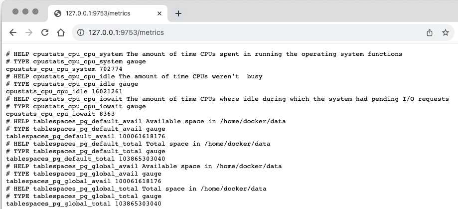

[](https://github.com/maropu/pg_stats_exporter/blob/master/LICENSE)

This is an experimental prototype of a PostgreSQL metrics exporter for Prometheus.

## How to collect metrics from PostgreSQL

This exporter implementation assumes that [pg_statsinfo](https://github.com/ossc-db/pg_statsinfo/blob/main/doc/pg_statsinfo.md)
is installed in a target PostgreSQL. If `docker` is already installed in your environment, you can run scritps below
to launch PostgreSQL with `pg_statsinfo`:

```
$ ./bin/build-docker-image.sh  && ./bin/run-docker.sh
```

Then, to export PostgreSQL metrics as Prometheus ones, you can launch an exporter via a command (Rust v1.72.0 or higher) below:

```
$ cargo run -- --postgres=127.0.0.1:5432 --user docker --dbname postgres
```

If you access `http://127.0.0.1:9753/metrics` in your favorite browser, the exporter will display the PostgreSQL metrics
in a format that Prometheus can load as follows:

<p align="center"></p>

## TODO

 - Add tests and support more metrics
 - Add scripts to use GitHub Actions for build and tests

## Bug Reports

If you hit some bugs and have requests, please leave some comments on [Issues](https://github.com/maropu/pg_stats_exporter/issues)
or Twitter ([@maropu](http://twitter.com/#!/maropu)).
